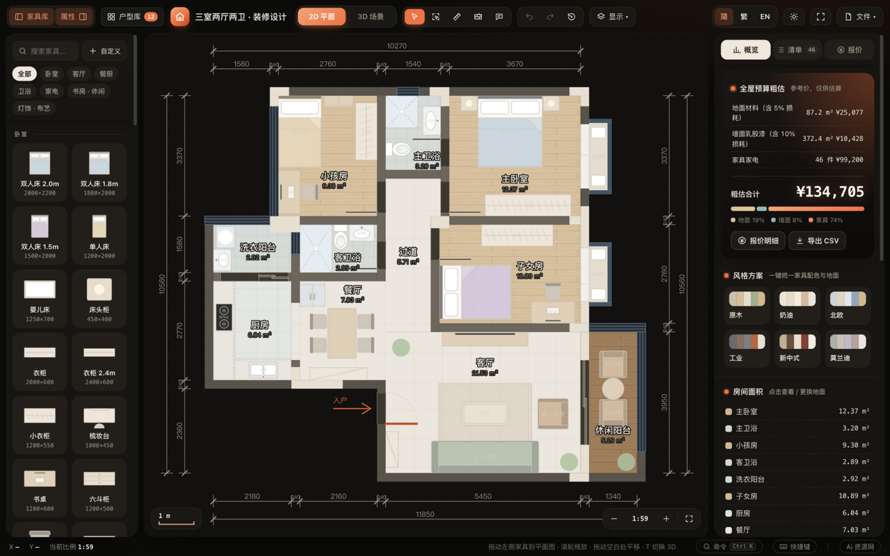
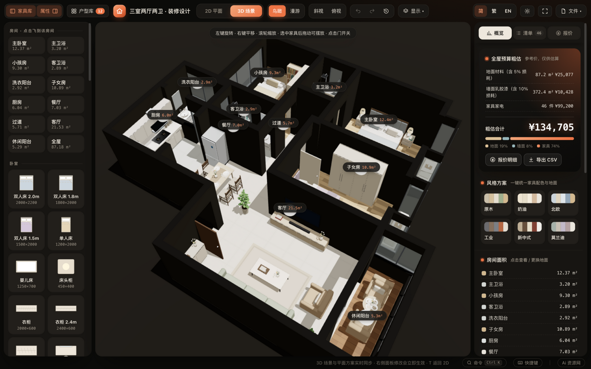
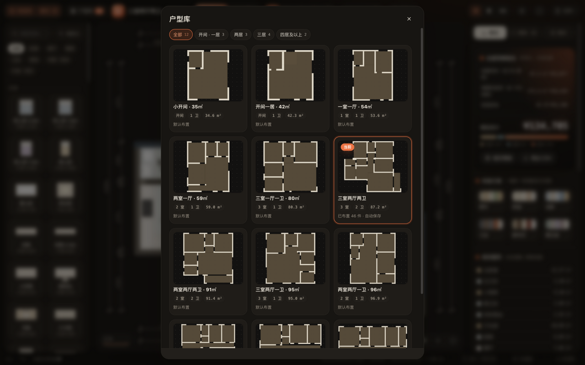
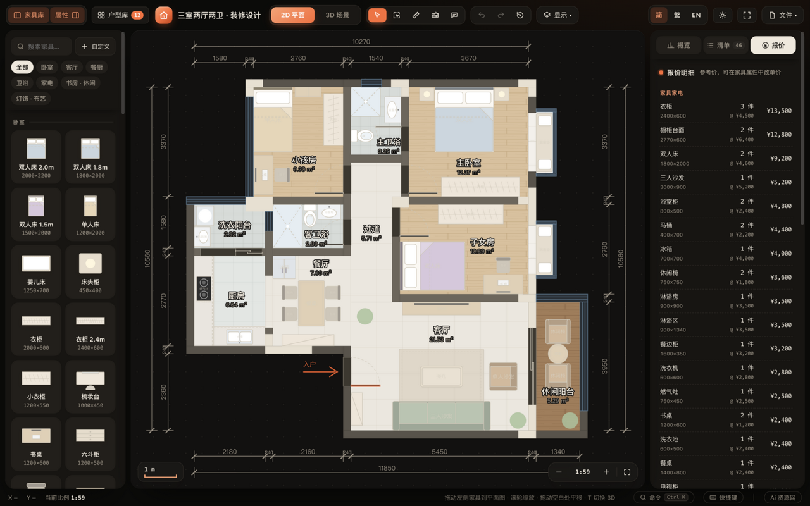
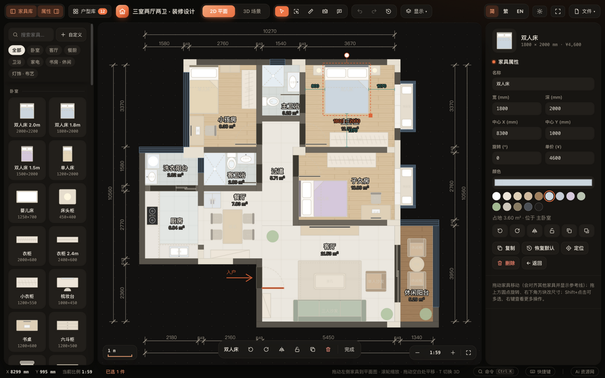
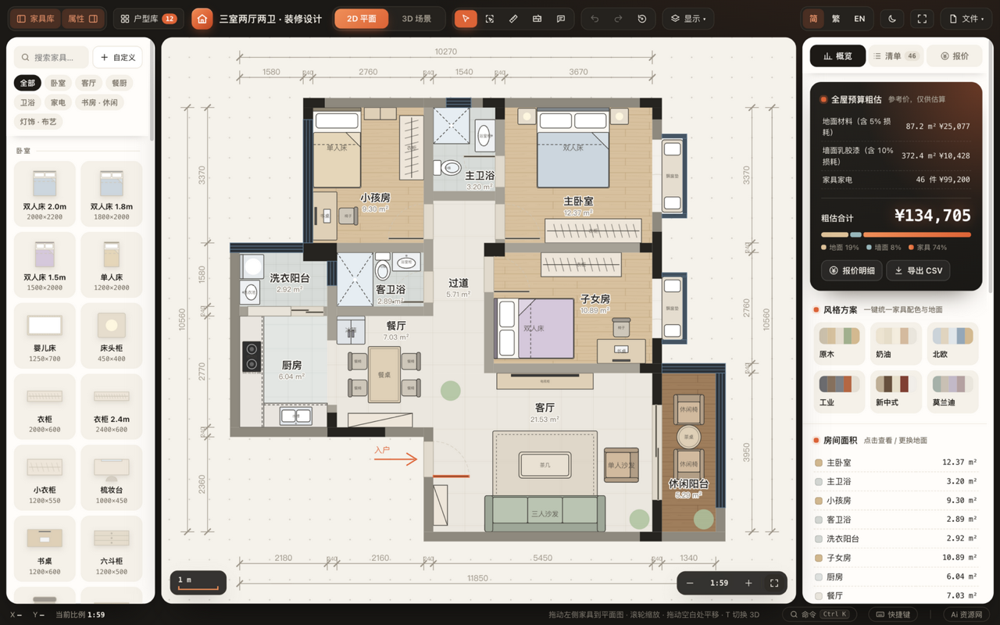
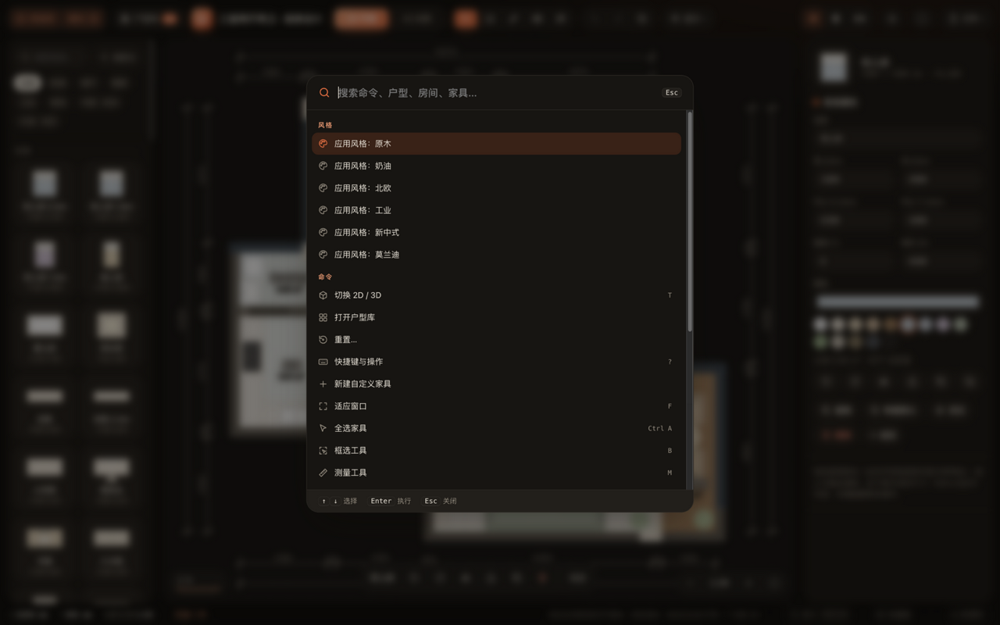
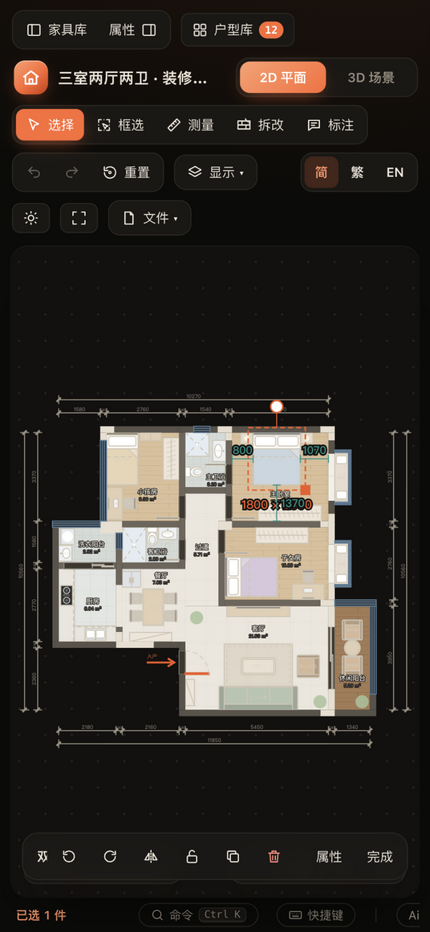

# 户型装修设计工具

在浏览器里打开 `index.html` 就能用的户型装修设计工具：左边拖家具、中间改平面、右边看预算，一键切 3D 看效果。**无需安装开发环境、离线可用**——双击即开，不用装环境、不用联网、不用登录，所有数据只存在你自己的浏览器里。



## 本 fork 的升级：DXF 优先，图片描图辅助

### 装修设计主流程

双击 `start-furnish.cmd` 启动本地服务并打开浏览器（需要已安装 Node.js）；关闭服务窗口自动释放端口。

1. 在 **户型库** 导入 DXF／图片或加载 `.furnish.json` 项目，核对墙体、门窗和飘窗。
2. 打开 **项目工作台 → 设置房间用途**，指定客厅、卧室、厨房、卫生间等用途。用途与显示名称独立保存，也可在房间属性里修改。内置户型和旧项目自动迁移；飘窗台单独统计。
3. 在画布布置家具、设置地面材料。选中家具后可输入 **精准距墙** 的左、右、上、下尺寸（mm），从旋转后的家具外边缘计算；输入 0 可贴墙。锁定家具、穿墙和移出房间的操作会拒绝。现有多选对齐、等距分布和拖动吸附继续可用。
4. 从工作台 **保存／比较方案** 建立 A、B 等方案，比较布局、材料、工程量和完整预算。房间用途随方案独立保存，结构调整按空间重叠继承。
5. **导出方案成果** 生成可离线打开的 HTML，包含平面图、房间材料、家具清单、装修工程和完整预算。先进入 3D 选择视角，可附上效果图；打开成果文件后可打印／另存为 PDF，并下载内嵌的可编辑项目文件，在另一浏览器继续编辑。

3D 新增 **定位选中**：可观察选中的房间、家具、普通窗或整个飘窗。只有与当前方案一致的三维截图才可用于成果导出，避免把旧方案效果图带入新成果。

第二轮：在 **保存／比较方案 → 管理命名方案** 中，可以编辑名称和备注、复制、用当前布置更新或删除版本；文件菜单也提供相同入口。更新和删除使用应用内确认窗口，同一户型不允许重名。3D 的日照时间、夜景、墙体剖切、家具和标签显示随项目及命名方案保存，刷新或载入方案会恢复。精准距墙编辑同时检查移动路径，避免越过隔墙进入另一个房间。

第三轮：方案比较、当前预算和交付报告分别读取对应方案的有效门窗与墙体数据，已保存版本不会受当前窗高／门方向修改影响。使用空间检查新增家具重叠和边缘越界，定位重叠时同时高亮两件家具；核对后忽略的记录在几何改变后失效。成果报告新增 **门窗尺寸清单** 与 **设计核对记录**，三面飘窗合并为一个整体，保留待核对事项、已确认事项及未分类房间用途。

第四轮：**文件 → 恢复记录** 可以手动保留恢复点、预览布置、恢复或导出该记录。清空、重置、载入方案／项目、更新或删除命名方案前自动保留旧内容，恢复后仍可撤销。每个户型最多 8 条、总计最多 64 条，记录按容量限制淘汰旧项；长期留存请导出项目文件。项目及恢复记录同时支持 IndexedDB，缓存容量不足时可以刷新恢复；保存失败会明确显示“未保存”。清除本机数据同步清除两种存储，防止旧项目刷新后重新出现。加载项目时同名不同版本自动改名，相同版本不重复加入，超出方案数量限制则保持原内容。

第五轮：**项目工作台 → 采购清单**（文件菜单也有入口）按尺寸、品牌／型号及价格区分家具，支持待选型、已确认、已下单、已到货筛选和金额汇总。填写状态／备注后点击“保存本组采购信息”，同步到同组家具，可撤销；资料编辑可核对实际宽深高、单价、价格日期和来源链接。参考价、未录入实际高度会标明，状态不改变设计预算。采购 CSV 和交付报告包含数量、房间、资料及状态，项目加载后可继续编辑。报价不再把不同规格合并，界面、报告和 CSV 金额统一四舍五入到整数元；内部计算保留原始价格。

第六轮：选中家具后可设置 **尺寸调整基准**（中心／左／右／上／下），改宽深时保持对应边缘位置，旋转家具按平面外包框计算；品牌家具资料编辑沿用相同基准。属性面板即时提示占墙、重叠、越界及开启空间冲突，也可打开全案检查。凹形房间缺口纳入占地检查。提醒供人工核对，改尺寸不自动推开家具；锁定后尺寸不可编辑，价格和采购资料仍可修改。

第七轮：复制／连续粘贴按 300 mm 逐次错开；靠近户型范围边缘时整组平移，保持旋转家具之间的相对位置，实际房间和墙体仍需核对。多选面板显示整组布置检查；批量统一尺寸、恢复默认尺寸遵循各件家具的尺寸调整基准。剪切跳过锁定项；粘贴超过 2000 件上限时拒绝且不改变当前方案。

第八轮：成果导出可选择图纸尺寸链、已保存测量线和文字标注。平面图统一使用浅色结构配色，保留自选家具颜色，移除选框、锁定图标和编辑碰撞纹理；外围标注和家具纳入图纸范围。成果 HTML 中可下载独立平面 SVG 和可编辑项目；图纸选项只影响展示，项目仍保留完整测量与标注。

第九轮：刷新、切换户型、导入项目和载入命名方案保留有效家具原坐标，范围外家具不再自动搬回；可在属性面板定位检查或主动“移回”，操作可撤销。项目备份和户型库共享来源户型预览，包含实际家具、门窗编辑、拆改、净面积、测量／标注数量与门窗尺寸；预览取消不修改当前方案。

第十轮：自定义家具通过来源编号关联默认规格，同名或改名后仍能恢复正确宽深高、颜色及参考价格；删除库条目保留已摆放家具的原始规格。项目加载会合并家具库并同步更新当前及命名方案的来源编号。最近使用也按来源区分，自定义卡片显示高度与品牌／型号。旧数据来源有歧义时跳过默认恢复，保留现有尺寸和价格并提示手动编辑。

第十一轮：项目加载前检查当前及命名方案中的拆墙、门窗和标注数据，错误提示具体方案与编号，失败不改变现有内容。旧方案 JSON 先检查再切换户型；旧标注的重复编号、缺失样式及数字字符串坐标自动迁移。标注最多 2000 条。导出的完整项目、成果内嵌项目及恢复点也检查门窗与拆墙引用，避免生成无法加载的文件。

第十二轮：**采购清单 → 编辑本组资料** 可统一修改同款家具的品牌、型号、价格日期、来源链接及单价，也可恢复整组来源参考价；支持撤销重做。跨房间和锁定家具的采购资料一起更新，位置和尺寸继续逐件编辑。未更改单价时保留原始精度及价格依据；批量资料随 CSV、成果和项目文件导出。

第十三轮：复制／粘贴和“复制一件”新增家具从 **待选型** 开始，保留规格、价格及备注；原家具采购进度不变。剪切后的首次粘贴保留原编号与进度，后续粘贴作为新副本。撤销粘贴后可重新移动，撤销剪切后粘贴会避免重复编号；混合选择剪切跳过锁定项。

第十四轮：单选家具的 **完整家具资料** 与多选的 **编辑选中家具采购资料** 统一资料编辑入口。未修改的价格精度、未知高度、锁定与各件尺寸保持正确；混合资料可统一修改或明确清空。

第十五轮：家具库支持名称、品牌、型号及最大宽／深筛选。选中单件后 **查找并替换**，先查看候选尺寸与空间冲突，再应用；保留编号、旋转和尺寸调整基准，新产品从待选型开始，支持撤销。

第十六轮：**工作台 → 工程预算** 可编辑各地面材料单价、乳胶漆单价、地面与涂刷损耗率。留空材料单价采用默认参考价，损耗率允许 0–100%。参数随命名方案、恢复记录与项目保存，主概览、房间估价、比较、CSV 和成果报告统一计算；金额仍显示到整数元。

第十七轮：**工作台 → 交付前核对** 或成果导出窗口可查看结构确认、未分类房间、缺失家具高度／品牌／型号、参考价格和空间冲突。操作可定位相应对象并补充资料；核对记录随成果导出，几何改变会使旧空间忽略记录失效。抬高飘窗台不作为通道检查。

第十八轮：完成实际 DXF 导入、飘窗、家具资料与替换、预算、版本比较、核对、三维成果、CSV／项目下载、重新加载、撤销恢复与刷新验收。弹窗支持 Tab 焦点循环、Esc 关闭及返回触发按钮；320 px 屏幕预算／资料／比较／备份／检查与成果无横向溢出。零预算占比显示 0%，三维切换动画结束前不提供成果截图，空间核对避免重复序列化相同几何。

开发验证统一运行 `node scripts/check.cjs`，检查生产脚本语法、全部几何／项目回归和 12 套内置户型。见 [改进与验收记录](docs/IMPROVEMENTS.md)。

顶部 **「导入 DXF / 描图」** 打开自己的户型工作区，**「项目工作台」** 管理拆改对比、方案比较、完整备份、空间检查、工程预算和品牌家具。原有 12 套户型与家具布置保持兼容。

### DXF 导入（推荐）

1. 在 CAD 中准备 **墙体中心线图层**，保持房间轮廓闭合（门窗位置也保留连续中心线），以 ASCII DXF 导出。
2. 点击「导入 DXF（推荐）」，核对图纸单位并选择墙体图层。识别 HEADER 中的 `$INSUNITS`；单位缺失时必须手动指定。支持 mm、cm、m、英寸与英尺。
3. LINE、无弧段的 LWPOLYLINE、二维 POLYLINE 转为水平/垂直墙体。设置墙厚和墙类型，自动识别闭合房间，面积按墙内皮计算。
4. 在墙上放门窗，设置宽度、开启侧和入户门。入户门自动朝室内生成，保证 3D 漫游入口正确。门窗自动切开墙体，重叠及墙角/交接处冲突会被拒绝。
5. 点击「生成户型，开始布置」，使用原来的家具库、测量、预算、2D/3D 和打印功能。

仓库附带 **sample-centerlines.dxf**：6000 × 4000 mm 的两室中心线示例，200 mm 墙厚时净面积合计 21.28 m²。可直接导入验证流程。

### DXF 自动修复

导入时默认开启自动修复，先检查所选墙图层，再显示灰色原线与橙色修复线的对照预览。仅校验出闭合房间后才允许导入或下载修复后的 DXF，原文件不会被改写。

- 自动统一为毫米制 LINE 中心线，合并重复、重叠及共线碎段。
- 小接缝默认容差 30 mm；轻微倾斜默认最大 0.5°，横向偏移也须在接缝容差内。可调整或关闭修复。
- 可选「双线墙转中心线」：按导入墙厚配对平行线，移除可确定的短封口，并连接相邻中心线。配对有歧义时停止导入，请检查图层或手工处理。
- 下载输出只包含所选墙线，按类型输出到 FURNISH_BEARING / FURNISH_PARTITION / FURNISH_EXTERIOR 图层；标注、家具、门窗符号及其他图层不包含在输出中。
- 弧墙、复杂块、三维实体、明显斜墙、大范围缺失仍需人工处理。自动修复后的结构和尺寸应结合对照预览核对。

附带 sample-needs-repair.dxf 演示重复线、碎段、小断口与轻微倾斜的修复；sample-double-walls.dxf 演示 200 mm 双线墙转换。

### 原始结构与装修设计

新导入户型先处于原始结构录入阶段：允许逐墙分类、核对尺寸、补录承重墙上原有门窗。点击「确认原始结构并锁定」后保存，进入装修阶段。可通过项目工作台「复制原始户型重新核对」为旧户型或需要重新确认的图纸建立独立副本，保留原方案。原始结构独立保留，承重墙、外墙及其已有门窗锁定；非承重墙可通过墙属性移动、改长度／厚度，或新建与拆除。

自定义户型主界面拆改会真正移除墙段及关联门窗，重新识别房间、计算净面积并更新材料与工程量。红虚线标记拆除，绿线标记新建／移动；可撤销，也可下载拆改对比 SVG。内置示例仍使用原项目拆除标记。

### 分图层墙类型与承重墙锁定

导入时，给每个选中的 DXF 图层分别指定「承重（锁定）」「非承重（可修改）」或「外墙」。普通图层必须明确指定；本工具导出的 FURNISH_BEARING / FURNISH_PARTITION / FURNISH_EXTERIOR 图层会恢复对应类型。类型依据结构图由用户确认，不按厚度猜测。

自动修复不混合不同类型的共线碎段或双线配对；修复下载按类型输出三个图层，保存、刷新、JSON 导出导入也保留类型。重合墙线存在类型冲突时停止导入。

确认原始结构后，承重墙在主界面禁止拆除；在户型编辑器中禁止删除和增删门窗。存在承重墙时，也不能重新校准或替换 DXF/图片以改写原结构；可新建另一户型重新录入。保存时再次核对已有承重墙的类型、位置、墙厚和门窗。撤销/重做仍可恢复自己的历史步骤；既有门的开启方向可调整，不改变墙洞几何。

黑色为承重墙、棕色为非承重墙；主界面「显示 → 承重墙」可高亮。附带 sample-layer-walls.dxf：BEARING 图层为四面承重外轮廓，PARTITION 图层为可修改的中间隔墙，可用于验证分类和锁定。

### 图片描图（辅助）

支持 PNG/JPG/WebP，以及本地 PDF 页面渲染为底图（原图上限 20 MB，本地缩小压缩保存）。导入后点击一条已知尺寸的两端，输入实际长度（mm）校准，再沿墙中心线连续点击。自动锁定水平/垂直并吸附已有端点；Esc 结束一段。墙厚 60–600 mm，门窗宽 300–6000 mm。

滚轮缩放，中键或 Alt+拖动平移；工作区有独立撤销/重做。取消不会修改已有方案。文件解析和图片处理均在本机完成。

PDF 使用随项目打包的 [PDF.js 6.4.299](https://github.com/mozilla/pdf.js)，含字符映射、标准字体与解码资源。通过本地 HTTP 服务导入，运行 `node scripts/serve.cjs` 后打开 `http://127.0.0.1:8765/`；无需 npm 安装。多页可选择页码，仍需校准与描墙。

### 项目工作台

- 方案并排比较：独立保存墙体、家具、材料、工程费用，对比面积、拆改量和完整预算。
- 完整项目备份：版本号、完整性校验、旧 JSON 迁移，包含原始结构、当前与所有命名方案、品牌家具库、OBJ 网格、图片底图及手动添加的源文件附件。
- 使用空间：门与家具／墙／其他门的开启冲突，柜门／抽屉正面净空，候选狭窄间隙扫描；提醒阈值可调整，不作为完整路径或规范结论。
- 装修工程：人工、水电、拆改、防水、吊顶、定制柜等自填单价；工程量可手填或绑定净面积、涂刷面积、拆墙和新墙长度，与主概览／完整报价 CSV 同步。
- 品牌家具：品牌、型号、尺寸、价格日期、来源链接；本地静态 OBJ 网格按宽高深缩放显示（Y 轴向上，暂不包含贴图／MTL）。
- 自动保存：增加 IndexedDB 原子化大容量镜像和较新项目自动恢复，缓解浏览器旧存储容量不足；仍建议定期导出项目文件。

[实机测试清单](docs/TESTING.md) 提供每阶段步骤、示例和预期数值。

### 保存与迁移

自定义户型进入户型库，并与家具、命名方案、历史快照一同保存。通过「文件 → 导出方案 JSON」备份/分享完整自定义户型，包含墙体、门窗和图片底图；在新浏览器中导入即可恢复。自定义户型使用 JSON 分享，内置户型仍支持 URL 分享。

### 当前边界

- **不是任意 CAD 图纸的自动识别器**：可选转换简单且墙厚一致的双线墙；复杂轮廓请在 CAD 中准备中心线。
- INSERT 块、弧线、填充和标注不会转换为墙或门窗；门窗需手工放置。超过修复容差的斜线或弧段会被拒绝。
- 支持正交、闭合、无庭院/独立柱岛的平面户型；最多 100 段中心线及 100 处门窗，DXF 上限 20 MB。不支持 DWG、二进制 DXF；PDF 仅作底图，不自动识别墙线。
- 多段线宽度不作为墙厚；墙厚由导入设置指定。DXF 的 Y 轴会转换为平面画布方向，实际尺寸不变。
- 导入后可重新打开工作区改墙线。自定义户型的拆改会重算房间面积；内置户型继续沿用原项目拆除标记。
- 离线分发请保留 index.html、所有 JS 文件及 vendor 目录在同一目录，不能只复制 HTML。

### 验证

`node tests/test-project.cjs` 检查结构阶段、真实拆改、房间匹配、工程量、项目备份、空间冲突与 OBJ；`node tests/test-wall-locks.cjs` 检查分图层类型、修复往返、冲突及承重锁定；`node tests/test-dxf-repair.cjs` 检查修复容差、双线转换、歧义、单位和修复后 DXF 往返；`node scripts/validate-plans.mjs` 检查原有户型；`node tests/test-custom-plans.cjs` 检查 DXF 单位/实体、闭合房间、净面积、门窗切洞、冲突和数据往返。

新增文件：dxf-import.js（DXF 解析）、dxf-repair.js（自动修复与兼容 DXF 导出）、floorplan-core.js（墙体/房间几何）、floorplan-editor.js（导入与描图界面）。新增 project-core.js（项目与检查计算）、project-storage.js（大容量保存）、project-ui.js（项目工作台）。PDF.js 以固定版本随 vendor 目录本地分发，保留许可证；其他功能不依赖在线服务。

## 友情链接

- 🏠 **[Ai 资源网](https://human.rlybtd.com/)** —— 免费 AI 工具与资源导航站，本项目页脚同样挂着这枚友链，欢迎互相串门。

> 想交换友链？改这一节提 PR 即可。

---

## 目录

- [30 秒上手](#30-秒上手)
- [界面速览](#界面速览)
- [功能详解](#功能详解)
  - [户型库与方案管理](#户型库与方案管理) · [家具库](#家具库) · [编辑与选中](#编辑与选中) · [编辑辅助](#编辑辅助)
  - [预算与报价](#预算与报价) · [风格方案](#风格方案) · [2D 工具](#2d-工具) · [3D 场景](#3d-场景)
  - [导出、打印与分享](#导出打印与分享) · [外观与语言](#外观与语言) · [数据与防丢失](#数据与防丢失)
- [键盘快捷键](#键盘快捷键)
- [数据存放](#数据存放)
- [项目结构](#项目结构)
- [如何新增一套户型](#如何新增一套户型)
- [实现与维护说明](#实现与维护说明)
- [已知边界](#已知边界)

---

## 30 秒上手

1. **打开**：双击 `index.html`（或丢进任意静态服务器）。
2. **选户型**：顶栏「户型库」有 12 套户型，挑一套点进去，自带一套摆好的默认布置。
3. **改布置**：左侧家具库点一下添加、拖到平面图上摆放；拖动家具移动，拖上方圆点旋转，拖右下方块改尺寸。
4. **看效果**：顶栏切到「3D 场景」，`T` 键来回切；3D 里可切「鸟瞰 / 漫游」，拖动鼠标左键旋转、滚轮缩放。
5. **算钱**：右侧「报价」页给出家具家电 + 地面 + 墙面乳胶漆的参考价，可导出 CSV。
6. **存下来**：改动自动保存在浏览器里；「文件 ▾ → 另存为方案」可为一个户型存多套布置，「文件 ▾ → 复制分享链接」把整套布置压进一条 URL 发给客户。

> 想装成桌面 App：用 Chrome / Edge 打开后选择「安装应用」，会读取 `manifest.webmanifest`，以独立窗口运行（PWA，图标见 `icon-192.png` / `icon-512.png`）。

## 界面速览

| 三维场景 | 户型库 |
| --- | --- |
|  |  |

| 报价明细 | 家具属性编辑 |
| --- | --- |
|  |  |

| 亮色主题 | 命令面板 |
| --- | --- |
|  |  |

手机 / 平板（触屏适配，浮动工具条 + 底部操作栏）：



---

## 功能详解

### 户型库与方案管理

内置 **12 套户型**（均为套内面积，单位 mm），顶栏「户型库」打开卡片画廊，可按居室（开间 / 两居 / 三居 / 四居及以上）筛选；卡片上标着每套的面积、居室数、卫数与布置状态（「默认布置」或「已布置 N 件 · 自动保存」），当前户型带「当前」角标。

| 户型 | 套内 | 户型 | 套内 |
| --- | --- | --- | --- |
| 小开间 · 35㎡ | 34.6 m² | 三室一厅一卫 · 80㎡ | 80.3 m² |
| 开间一居 · 42㎡ | 42.3 m² | 三室两厅两卫（默认） | 87.2 m² |
| 一室一厅 · 54㎡ | 53.6 m² | 两室两厅两卫 · 91㎡ | 91.4 m² |
| 两室一厅 · 59㎡ | 59.0 m² | 三室两厅一卫 · 95㎡ | 95.0 m² |
| 两室两厅一卫 · 96㎡ | 96.9 m² | 横厅三居两卫 · 128㎡ | 127.4 m² |
| 四室两厅两卫 · 129㎡ | 128.0 m² | 四室两厅三卫 · 141㎡ | 140.5 m² |

套内面积按计入面积统计（飘窗等不计入，打印清单里带 `*` 标出）。

- **每个户型独立保存**：切换户型不会丢改动，回来还是原样。
- **多方案**：「文件 ▾ → 另存为方案」把当前布置存成命名方案，同一户型可存任意多套，随时载入 / 删除。
- **历史快照**：「文件 ▾」里的历史列表可回滚到之前的自动存档点。
- **一键恢复**：户型没布置时画布中央会提示，可一键套用该户型的推荐布置。

### 家具库

- **74 件内置家具**，分 7 类：卧室 15 · 客厅 16 · 餐厨 12 · 卫浴 8 · 家电 9 · 书房 · 休闲 6 · 灯饰 · 布艺 8。
- **搜索 + 分类筛选 + 最近使用**，每件家具标出宽×深与参考单价。
- **点按添加**（加到房间中心或视图中央）**或拖拽摆放**（落到指针位置），拖动时贴墙吸附，松手自动避让墙体——只会在原房间内推移，不会被推到墙外。
- **自定义家具**：「＋ 自定义」可建任意名称 / 尺寸 / 高度 / 形状（矩形、圆形）/ 颜色 / 单价的家具，保存在「我的家具」分类里反复使用；3D 中按实际尺寸渲染。

### 编辑与选中

- **选择**：点选；`Shift+点击` 加选 / 减选；`Shift+拖动` 或在「框选」工具下拖矩形框选；`Ctrl/⌘+A` 全选。
- **变换**：拖动移动、拖上方圆点旋转（`Shift` 任意角度）、双击家具转 90°、拖右下方块改宽深；整组选中后可一起移动 / 旋转。
- **复制粘贴**：`Ctrl/⌘+C / X / V` 复制 / 剪切 / 粘贴到指针处，`Ctrl/⌘+D` 原地创建副本。
- **多选排版**：左中右 / 上中下对齐、等距分布、统一尺寸，一键成组排整齐。
- **其它**：镜像（`H`）、锁定（`L`）、置顶 / 置底、恢复默认尺寸颜色、删除（`Delete`）；方向键微调 10 mm（`Shift` 100 mm）。
- **右键 / 触屏长按**弹出操作菜单；选中后底部还会浮出一条常用操作栏（复制 / 旋转 / 镜像 / 锁定 / 置顶 / 删除）。

### 编辑辅助

「显示 ▾ → 编辑辅助」里逐项开关，设置会被记住：

- **贴墙吸附**：拖动家具时自动吸附到墙面。
- **对齐参考线**：与附近家具的边缘 / 中线对齐时显示参考线。
- **净距标注**：选中家具时标出到四周墙面的净距（如「800 / 1070」）。
- **碰撞检查**：互相重叠的家具用红色斜线标出（地毯、壁挂、台面设备、绿植等不参与；椅子推进桌下不算重叠）。
- **移动步长**：1 / 10 / 50 / 100 mm。
- 「显示 ▾」同时还有平面图层开关（尺寸、房间、家具、网格、承重墙、标注）、1:60 / 1:100 快捷比例，以及 3D 场景开关（全高墙 / 剖切墙 / 家具 / 房间名 / 夜景 / 日照时间）。

### 预算与报价

右侧面板分「概览 / 清单 / 报价」三页，未选中任何东西时显示：

- **概览**：全屋预算粗估（地面材料、墙面乳胶漆、家具家电，含损耗）、占比条、六种风格一键套用、房间面积表（点击查看 / 更换地面）、地面材料估算、方案统计与常用操作提示。
- **清单**：按房间分组的家具清单，可定位（飞到该家具）、锁定，并标出「跑到户型外」或「互相重叠」的家具，支持一键移回 / 选中。数量角标会实时提示问题件数。
- **报价**：同名同价合并的报价明细（件数 × 单价 = 小计），家具家电 + 地面 + 墙面乳胶漆合计，可导出 CSV（Excel 直接打开）。

预算里的每一项都能改：家具单价可在属性面板里手填，材料单价与损耗率可在工作台工程预算里设置，地面材料可从 8 种里换（橡木 / 胡桃木地板、800 / 600 地砖、大理石、300 防滑砖、水磨石、满铺地毯，各带参考单价与损耗率）。

### 风格方案

「概览」页提供 **原木 / 奶油 / 北欧 / 工业 / 新中式 / 莫兰迪** 六种风格，一键统一所有家具配色与客厅、卧室地面，可撤销。

### 2D 工具

- **测量**（`M`）：两点测距，`Shift` 锁定水平 / 垂直。
- **拆改墙体**（`X`）：拆除可拆的非承重墙，承重墙受保护；「显示 ▾ → 承重墙」可高亮承重墙。
- **文字标注**（`N`）：在平面图任意位置加说明文字，4 种颜色 / 3 种字号，可拖动、双击编辑，随方案保存、导出与打印。
- **门窗**：点选门 / 窗可改开启方向、推拉门方向与窗台高度。
- **房间**：点选房间可改名、换地面材料。
- **画布**：右下角缩放胶囊（点比例在 1:50 / 1:60 / 1:100 / 1:200 间切换）、适应窗口；底部状态栏实时显示鼠标坐标、当前比例、悬停与选中信息。

### 3D 场景

- **鸟瞰 / 漫游**两种模式：鸟瞰（左键旋转、右键平移、滚轮缩放，还有「斜视 / 俯视」预设）；漫游为第一人称，`WASD` 行走、`Shift` 快走、`E` 开关正前方的门，触屏用摇杆，从入户门进入。
- **光照**：「日照」滑杆（7:00–18:00）与夜景模式。
- **剖切墙**：切到 1.2 m 高看内部布局，或全高墙看完整空间。
- **房间名标签**与「房间」列表：点房间名飞到该房间。
- **实时同步**：3D 与 2D 平面共用同一份数据，右侧面板改动立即生效。

### 导出、打印与分享

「文件 ▾」菜单：

- 🔗 **复制分享链接**——把整套布置压缩进 URL（`#p=户型&v=数据`），发给客户打开即可还原，无需服务器。
- **导出图片**（PNG）、**导出报价清单 CSV**、**打印**（专排打印样式：白底，只输出平面图与页眉信息表，隐藏全部界面元素）。
- **导出方案 JSON** / **导入方案**——备份与迁移，导入时自动修复坐标异常的家具。
- **另存为方案** / **历史快照** / **重置…** / **清空布置**。

### 外观与语言

- **亮色 / 暗色主题**（首次按系统偏好），全界面与 3D 场景联动，顶栏一键切换。
- **简体中文 / 繁體中文 / English** 三语，界面文案、家具名、房间名、材料名、户型名全部跟着切。
- **全屏**（`Shift+F`）、左右面板可收起（`[` / `]`）腾出画布。

### 数据与防丢失

- 改动**自动保存**，状态显示在页脚；存储空间不足会明确提示。
- 载入 / 导入时自动修复坐标异常的家具；删除、清空等操作后的提示条自带「撤销」。
- 家具图层被隐藏时画布顶部有提示，点击即可恢复显示。
- 完整的撤销 / 重做栈（`Ctrl/⌘+Z` / `Ctrl/⌘+Shift+Z`）。

---

## 键盘快捷键

页脚「快捷键」按钮（或按 `?`）随时查看完整列表。

| 工具与视图 | | 编辑 | |
| --- | --- | --- | --- |
| `V` | 选择 / 移动 | `Ctrl/⌘+Z` | 撤销 |
| `B` | 框选 | `Ctrl/⌘+Shift+Z` | 重做 |
| `M` | 测量（`Shift` 水平 / 垂直） | `Ctrl/⌘+C / X / V` | 复制 / 剪切 / 粘贴到指针处 |
| `X` | 拆改非承重墙 | `Ctrl/⌘+D` | 创建副本 |
| `N` | 文字标注 | `Ctrl/⌘+A` | 全选家具 |
| `Ctrl/⌘+K` | 命令面板（搜索一切） | `Delete` | 删除 |
| `T` | 切换 2D / 3D | `R` / `Shift+R` | 旋转 90° |
| `F` | 适应窗口 | `H` | 左右镜像 |
| `Z` | 缩放到所选 | `L` | 锁定 / 解锁 |
| `+` / `−` | 放大 / 缩小 | 方向键 | 微调 10 mm（`Shift` 100 mm） |
| `空格+拖动` / 中键 | 平移画面 | | |
| `[` / `]` | 收起 / 展开左右面板 | | |
| `Shift+F` | 全屏 | | |
| `Esc` | 取消选择 / 退出工具 | | |

鼠标 / 触屏：`Shift+点击` 加选、空白处 `Shift+拖动` 框选、右键或长按弹菜单、双击家具旋转、拖顶部圆点旋转（`Shift` 任意角度）、拖右下方块改尺寸、双指缩放平移。

3D 漫游：`W A S D` 移动、`Shift` 快走、`E` 开关正前方的门、`Esc` 暂停。

**命令面板**（`Ctrl/⌘+K` 或页脚「命令」）支持中英文混合搜索全部操作、风格、户型、房间、可添加的家具和已摆放的家具，回车执行——记不住快捷键时用它最快。

---

## 数据存放

纯前端，没有任何后端请求，数据都在 `localStorage`：

| 键 | 内容 |
| --- | --- |
| `huxing-design-v2` | 全部户型的布置、房间命名与地面、墙体拆改、门窗调整、测量线、文字标注、风格、自定义家具（自动兼容迁移 v1） |
| `huxing-history` | 历史快照 |
| `huxing-ui` | 图层开关 / 编辑辅助 / 移动步长 / 面板分页 |
| `huxing-theme` · `huxing-lang` | 主题、语言 |
| `huxing-recent` · `huxing-panes` | 最近使用的家具、左右面板开合状态 |

「重置 → 清除本机全部数据」会清空以上所有键（建议先导出方案 JSON 备份）。

## 项目结构

```
Furnish/
├── index.html              # 页面入口、内嵌 Three.js 与三维模块
├── start-furnish.cmd        # Windows 本地服务启动入口
├── manifest.webmanifest    # PWA 清单
├── src/
│   ├── app.js              # 应用状态、属性面板、指针事件与初始化
│   ├── core/               # 户型几何、吸附、项目／设计规则与工作方案恢复
│   ├── io/                 # DXF、存储／迁移、自动保存、恢复记录与分享编码
│   ├── ui/                 # 画布交互、属性面板、编辑器与各工作台界面
│   ├── render/             # 家具 SVG 图例与 2D 画布图层
│   └── data/               # 户型、家具、材料、语言、风格与 DXF 模板
├── styles/                 # 主界面、户型编辑器与项目工作台样式
├── assets/icons/           # 应用图标
├── examples/               # DXF、PDF、OBJ 导入示例
├── templates/              # DXF 模板原文件与历史回归夹具
├── vendor/pdfjs/           # PDF.js 及其离线资源
├── tests/                  # 回归脚本，helpers/ 提供统一路径入口
├── scripts/                # check.cjs、serve.cjs、validate-plans.mjs
├── docs/                   # 测试说明、改进记录、screenshots/
├── output/                 # 本地验收结果
└── README.md
```

项目仍使用浏览器原生脚本，无需 npm 安装或构建。`index.html` 按依赖顺序加载数据、规则、浏览器适配、渲染、主应用与 UI 扩展。风格、布局几何和家具图例可直接测试，预算面板、家具编辑操作、图片导出与 2D 画布图层已分离；主应用继续管理当前状态、属性面板和指针事件。Three.js 的 data-URL import map 与三维模块暂时保留在入口中，保证直接打开文件时的模块加载方式不变。详见 [模块与加载约定](docs/ARCHITECTURE.md)。

开发验证运行 `node scripts/check.cjs`，包含递归脚本语法检查、入口资源路径检查、全部回归与内置户型校验。单个测试可运行 `node tests/test-project.cjs`；脚本与测试根据自身位置解析项目路径，不依赖调用时的工作目录。本地服务运行 `node scripts/serve.cjs` 或双击 `start-furnish.cmd`。示例从 `examples/` 选择，模板原文件在 `templates/`。

## 如何新增一套户型

打开 `src/data/plans.js`，在最后一个户型对象（当前为 `const P12 = {...}`）之后照格式增加一个对象并加入 `const PLANS = [...]`，再在 `src/data/i18n.js` 的 `NAMES_EN` 中补上英文名。改完运行 `node scripts/validate-plans.mjs` 自检；户型库按名称中的「X室 / X卫 / 开间」自动识别居室数：

```js
const P13 = {
  id: 'p13',                      // 唯一 id
  name: '四室两厅两卫 · 140㎡',    // 显示名（英文界面查 NAMES_EN 表）
  en: '4BR · 2LR · 2BA · 140m²',  // 英文名
  note: '', noteEn: '',           // 副标题备注（可空）
  walls: [ [x0,y0,x1,y1,'类型'], ... ],  // b=承重 e=外墙 n=非承重 low=矮墙；外墙在门窗洞口处断开
  wins:  [ {rect:[x0,y0,x1,y1], sill:0.9}, ... ],     // 窗：sill=窗台高 m（head 默认 2.4）
  doors: [ {name, rect, h:[铰点], c:[关闭方向], o:[开门方向], len}, ... ],  // 入户门加 entry:true，o 指向室内
  slides:[ {rect, v:true} ],      // 推拉门，v = 竖向墙
  rooms: [ {id, name, poly:[[x,y]...], mat, at:[标签x,y], counted:false?}, ... ],  // poly 用墙内皮坐标
  dims:  [ {h:1, at:-750, start:0, segs:[...]}, ... ],  // 尺寸标注链，h=1 水平；at 为标注线位置
  bounds:{x, y, w, h},            // 画布初始范围（含标注留白）
  defaults:[ {t:'bed', n:'双人床', x, y, w, d, r, c?}, ... ],  // 默认家具布置
};
```

坐标约定：mm，原点 = 左侧外墙内皮与顶部外墙内皮。**入户箭头、3D 漫游出生点、窗台高、3D 场景中心全部自动推导**，无需另行配置。

`scripts/validate-plans.mjs` 直接读取 `src/data/plans.js`，检查字段合法性与坐标递增、门窗洞口不与墙段实体重叠、尺寸标注链每段为正且总长与墙长一致、房间多边形面积为正且在画布内、默认家具都在室内、门的方向向量 / 铰点 / 入户门唯一性。退出码 0 表示全部通过；修改 HTML 排版不影响数据校验。

## 实现与维护说明

**离线与依赖**

- three.js r160 已以 base64 data-URL 形式内联进 importmap（无 CDN 依赖），因此断网、`file://` 打开都能用。
- 升级 three.js：下载新版 `build/three.module.min.js` 与 `examples/jsm/{controls/OrbitControls,controls/PointerLockControls,geometries/RoundedBoxGeometry,environments/RoomEnvironment,renderers/CSS2DRenderer}.js`，逐个 base64 后替换 importmap 中对应 `data:text/javascript;base64,...` 的值（注意 importmap 内必须是纯 JSON，不能加注释）。

**加载与渲染**

- importmap 位于 `</body>` 前（而非 `<head>`），让 2D 界面先完成解析与首屏绘制。3D 模块写在 `create3D(...)` 工厂函数里，首次进入 3D（或鼠标移到「2D / 3D」切换按钮上预加载）时才 `import()` three.js 并创建场景；新增 three 插件时需同时加到 `load()` 的 import 列表与 `create3D` 参数。
- 3D 采用**按需渲染**：画面静止时不渲染。直接修改场景（增删物体、改材质 / 可见性 / 相机）后需调用 `invalidate()`，否则要等下一次交互才刷新；家具与平面实时同步走**增量重建**（签名对比，只有变化的图层重画）。
- 2D 用原生 SVG 绘制，家具 / 墙体 / 门窗 / 标注分图层（`#gFurn`、`#gWalls` …），选中态与手柄单独一层；大量元素下靠签名（`sigArch` / `sigFurn` / `sigLabels`）避免整树重建。

**样式**

- 视觉方向「制图工作室」：深墨色背板 + 纸面工作岛 + 朱红信号色 `#ef5a24`。
- 令牌分两层——`--s-*` 为卡片表面、`--shell-*` 为深色外壳（顶栏 / 页脚 / 浮动工具条 / 提示等，亮暗主题下都是深色）。组件只使用 `--ink` / `--card` / `--line` 等语义变量；外壳区域（`header, footer, .hero, #fab …` 选择器组）把语义变量重新指向外壳值，弹出菜单 / 对话框再指回表面值。暗色在 `:root[data-theme="dark"]` 覆盖两层取值。新增样式请复用语义变量而非写死颜色；平面 SVG 与 3D 中的选中色写在 JS 常量 `ACC` 等处。
- 画布点阵：`main` 的背景点阵由 `applyView()` 写入 `--gs / --gx / --gy`，与平面坐标对齐（1 m 一点，按缩放 2 倍调整）；开启「网格」图层时自动隐藏。

**数据模型**

- 方案数据另有 `notes`（文字标注 `{id,x,y,text,color,size}`）与 `style`（最近套用的风格 id）。
- 家具数据字段：`{id,type,name,cx,cy,w,d,rot,color}`，可选 `flip`（镜像）、`locked`（锁定）、`price`（手填单价，优先于家具库参考价）、`h`（自定义家具高度 mm）。家具库条目为 `[类型, 名称, 宽, 深, 颜色, 参考单价]`。
- 碰撞检查规则在 `src/core/layout-geometry.js`：`NOCOLLIDE` 排除地毯、壁挂、台面设备和绿植；`SEATS` / `TABLES` 允许椅子推进桌下。内置户型校验与运行时检查共同辅助核对布置。

**多语言**

- 静态文案写在元素上（`data-en` / `data-en-title` / `data-en-placeholder`），首次切换语言时把中文原文存进 `dataset` 作为简中回退；动态文案用 `tr(zh, en)`，专有名词（家具名、房间名、材料名、户型名）查 `NAMES_EN` 表。
- 新增界面文案若含简体专用字，需在 `S2T` 字表中补上对应繁体字，否则繁体界面会保留简体字。

## 已知边界

- 自定义户型拆改会重算房间与面积；内置户型拆改仍使用标记展示。
- 家具之间只做碰撞「检查」（标红提示），不会自动推开；自动避让只在拖动落点做一次（避让墙体，保持在原房间内）。
- 报价为参考价（材料单价 × 面积含损耗 + 家具库参考价），不是真实预算。
- 数据存在浏览器本地：换浏览器 / 设备 / 清理站点数据会丢，重要方案请「导出方案 JSON」备份或发分享链接。

---

## 许可

本项目以 [MIT 许可证](LICENSE) 发布。第三方组件：[three.js](https://threejs.org/) r160（MIT，已内联）。
